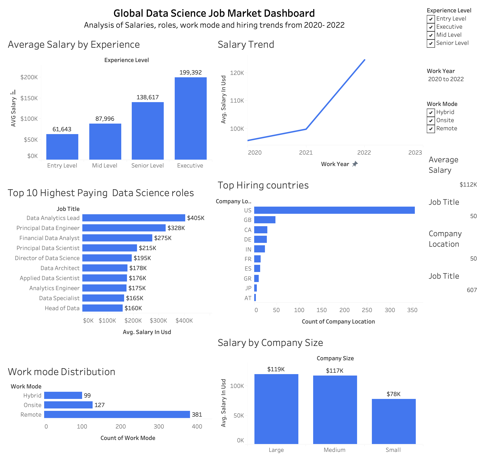

# Global Data Science Salary & Job Market Analysis

## Overview

This project explores global data science salaries, hiring trends, work arrangements, and job market patterns using real-world salary data from 2020–2022.

The objective was to identify key factors influencing salaries and understand how experience, location, company size, and employment type affect compensation in the data science industry.

---

## Technologies Used

- Python
- Pandas
- Matplotlib
- Seaborn
- Tableau Public
- Jupyter Notebook

---

## Project Structure

```
├── data/
├── notebooks/
├── images/
├── dashboard/
├── README.md
```

---

## Key Business Questions

- How does salary vary by experience level?
- Which data science roles pay the highest salaries?
- Which countries hire the most data professionals?
- How has salary changed over time?
- How does company size impact salary?
- What role does remote work play in the industry?

---

## Key Findings

### Salary Growth with Experience

Average salary increases significantly with professional experience:

- Entry Level: ~$62K
- Mid Level: ~$88K
- Senior Level: ~$139K
- Executive: ~$200K

### Highest Paying Roles

Some of the highest-paying roles include:

- Data Analytics Lead
- Principal Data Engineer
- Principal Data Scientist
- Director of Data Science

### Remote Work

Remote work represents a significant proportion of data science opportunities, demonstrating the continued importance of flexible working arrangements.

### Geographic Demand

The United States dominates hiring activity, followed by countries such as the United Kingdom, Canada, Germany, and India.

---

## Dashboard

### Tableau Dashboard



---

## Recommendations

### For Job Seekers

- Develop skills aligned with Data Scientist and Data Engineer roles.
- Gain practical experience through projects and internships.
- Focus on high-demand regions and industries.

### For Organisations

- Competitive salaries are critical for attracting experienced talent.
- Flexible work arrangements remain an important factor in recruitment.
- Investing in employee development can improve talent retention.

---

## Author

Ruchitha Sampath Weerasekara

MSc Data Science | Software Engineer | AI & Machine Learning Enthusiast
